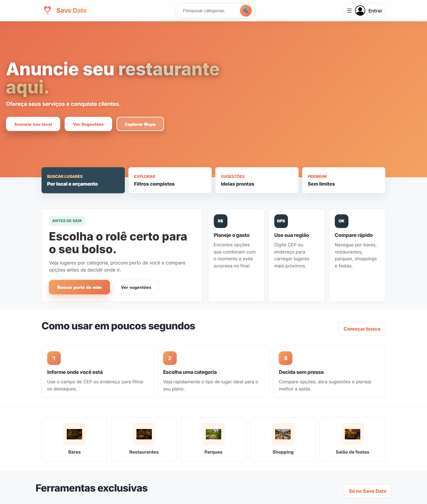
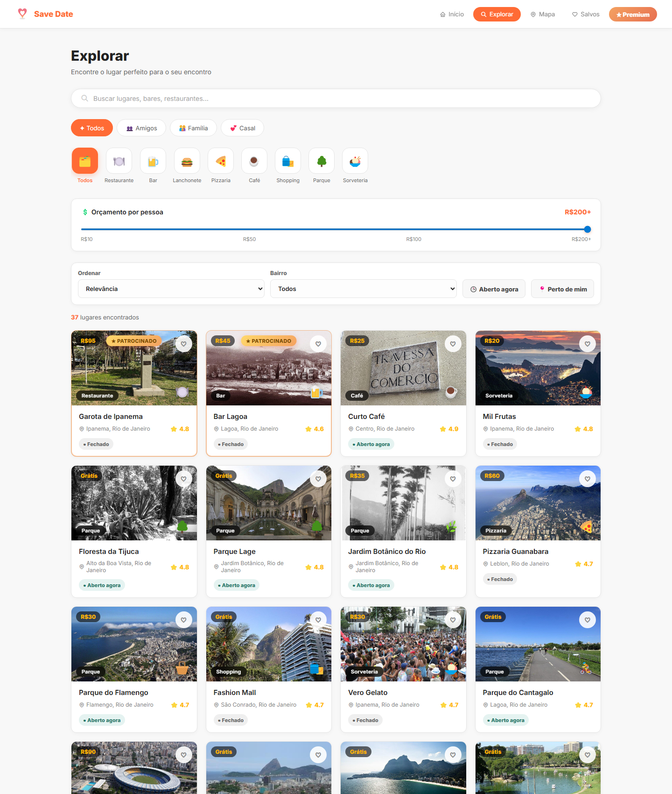
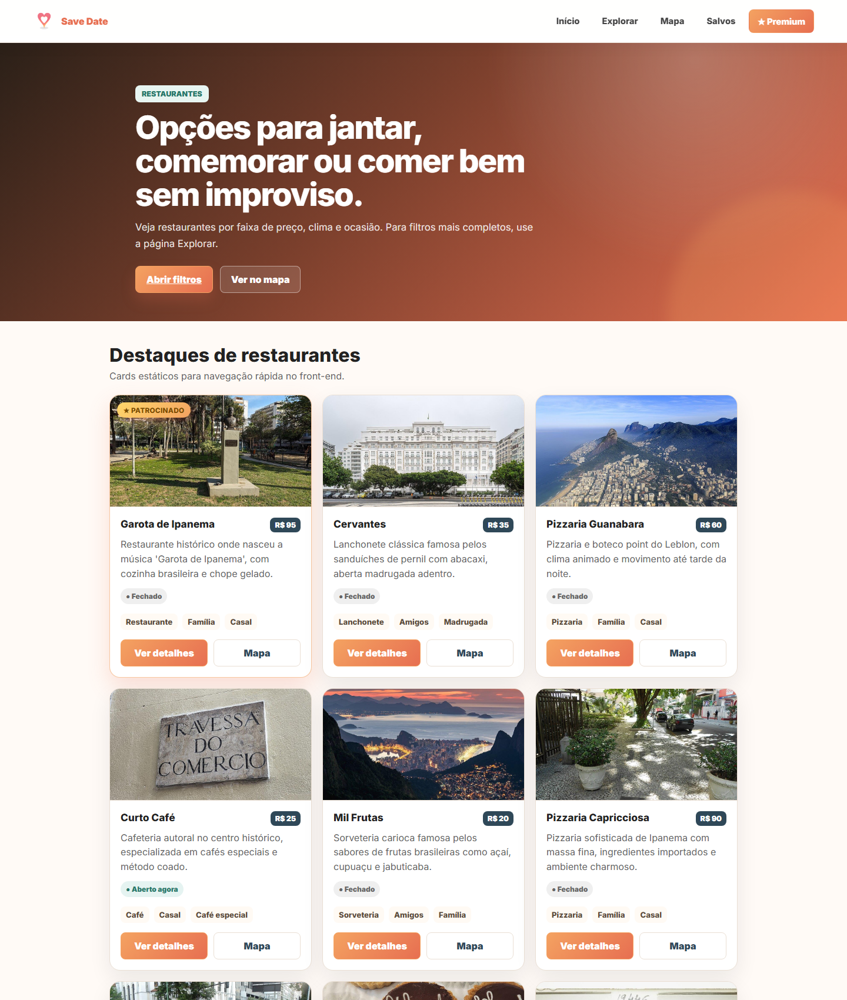
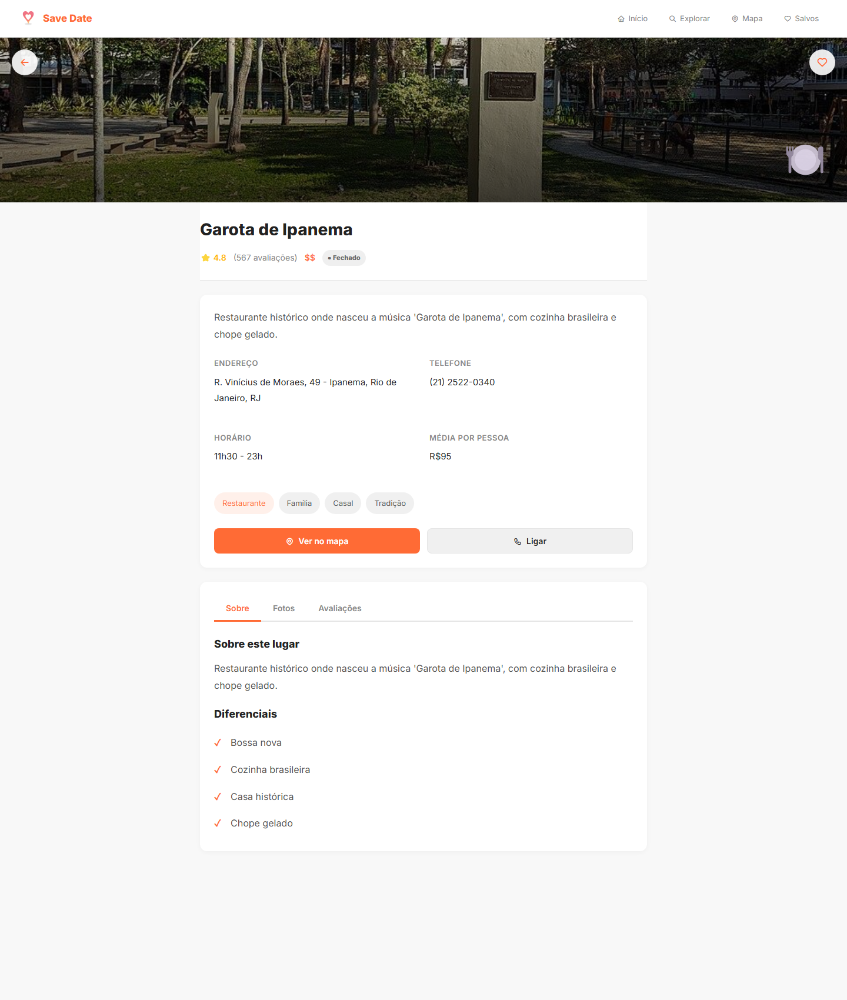
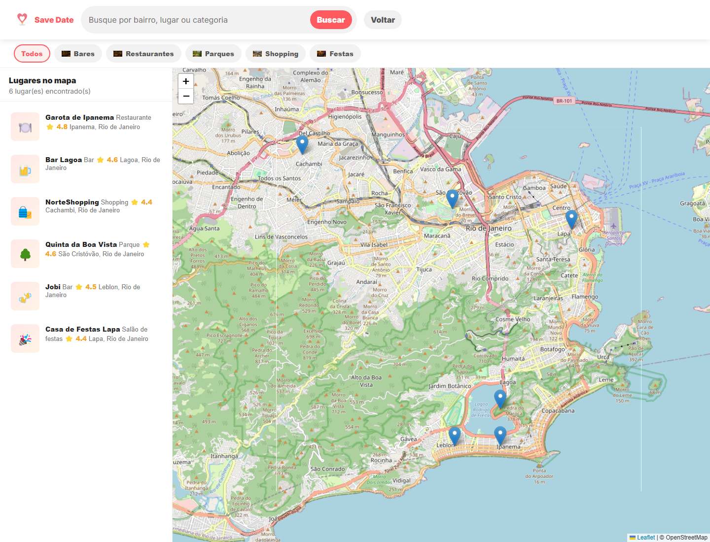
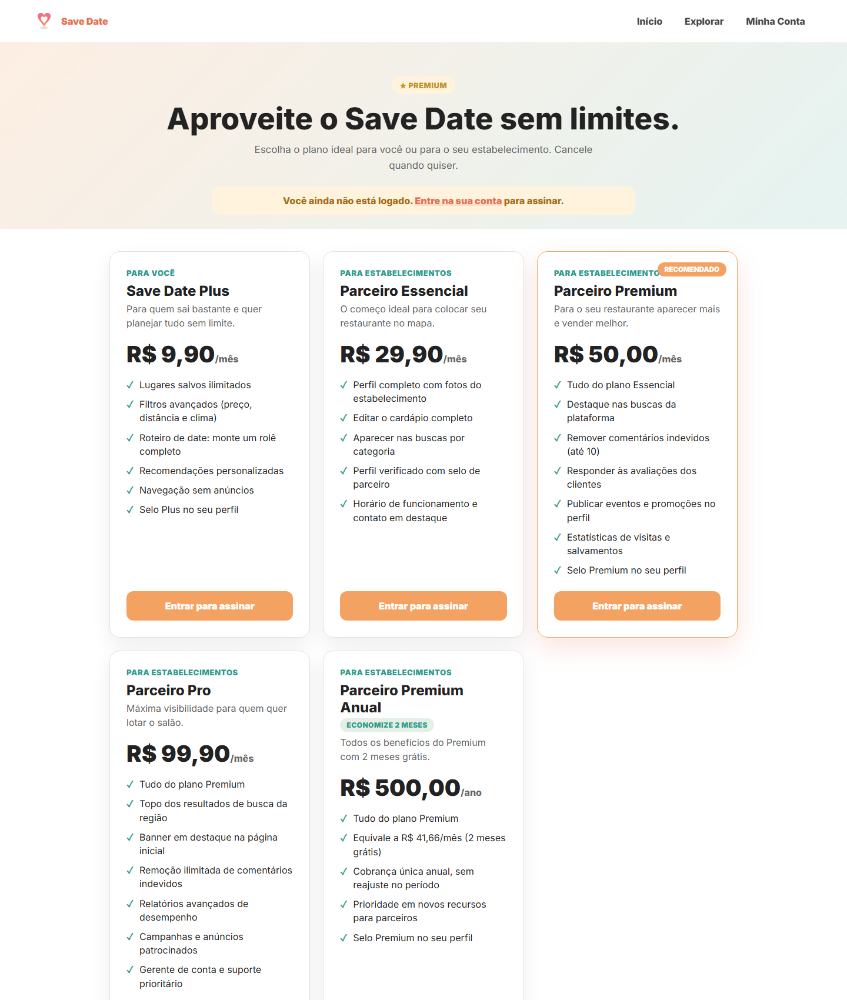
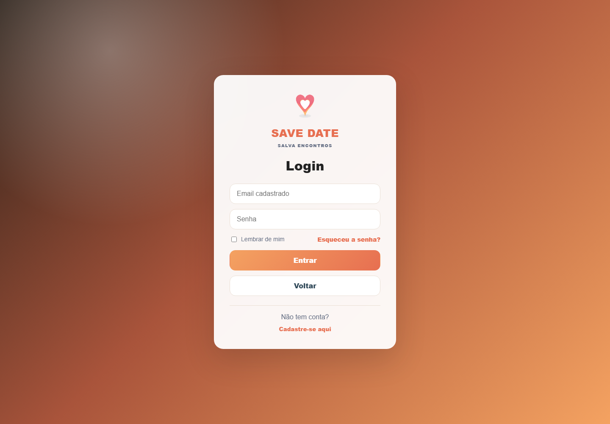
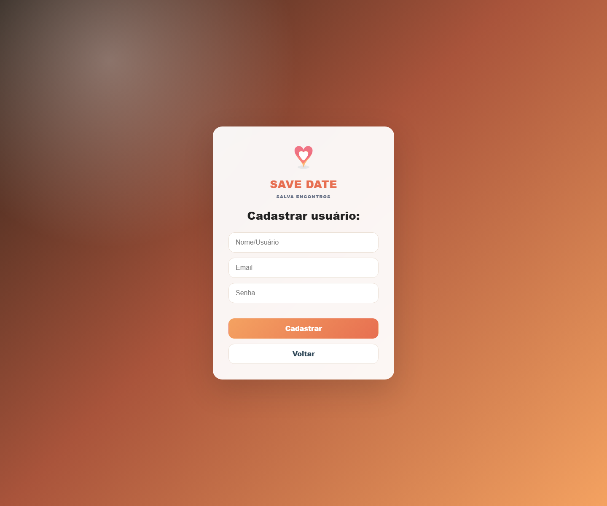

<div align="center">


# Save Date

**Explore sem sustos.** Plataforma para descobrir bares, restaurantes, parques, shoppings e salões de festa — com filtros por preço, localização e avaliações, mapa interativo e planos premium.


</div>

---

## 📖 Sobre o projeto

O **Save Date** é uma plataforma web para ajudar as pessoas a encontrarem o lugar certo para o seu rolê ou encontro, sem gastar mais do que planejam. O usuário filtra estabelecimentos por **faixa de preço, distância e ocasião**, compara opções, salva favoritos, vê tudo no **mapa** e ainda conta com ferramentas extras (roteiros, checklist, divisão de conta e planos premium).

Projeto desenvolvido no primeiro período da faculdade.

---

## 📸 Telas

### Página inicial
Hero, busca por categoria, ferramentas e destaques personalizados por localização.



### Explorar
Grade de estabelecimentos com filtros de categoria, orçamento por pessoa, avaliações e "aberto agora".



### Categorias
Listagem por categoria (restaurantes, bares, parques, shoppings, festas) com cards e fotos reais.



### Detalhes do lugar
Página completa do estabelecimento com fotos, endereço, contato, diferenciais e avaliações.



### Mapa interativo
Visualização dos lugares no mapa (Leaflet / OpenStreetMap) com lista lateral e marcadores.



### Planos Premium
Planos para usuários (Plus) e para estabelecimentos parceiros.



### Login e Cadastro
<table>
  <tr>
    <td></td>
    <td></td>
  </tr>
</table>

---

## ✨ Funcionalidades

- 🔎 **Busca e filtros** por categoria, faixa de preço, distância e ocasião
- 🗺️ **Mapa interativo** com marcadores dos estabelecimentos
- ⭐ **Avaliações** e sistema de favoritos / salvos
- 📍 **Destaques por localização** (busca por CEP/endereço via ViaCEP)
- 👤 **Contas de usuário e de estabelecimento** (login, cadastro, perfil)
- 💎 **Planos Premium** com ferramentas exclusivas (insights, campanhas, radar de vantagens)
- 🧰 **Ferramentas de rolê**: roteiro, checklist, comparar lugares, match e divisão de conta (racha)
- 🛠️ **Painel admin** para gestão dos estabelecimentos

---

## 🧱 Tecnologias

- **HTML5** e **CSS3** (layout responsivo, sem framework)
- **JavaScript** (vanilla) + **jQuery**
- **Leaflet** + **OpenStreetMap** para o mapa
- **localStorage** para autenticação e estado da aplicação
- **API ViaCEP** para preenchimento de endereço

---

## ▶️ Como rodar

Por ser um site estático, basta abrir no navegador:

```bash
# clone o repositório
git clone https://github.com/ThayrineLira/SaveDate.git

# abra a página inicial
# Save Date/home.html
```

> 💡 Para que todos os recursos funcionem corretamente, recomenda-se servir a pasta `Save Date/` por um servidor local (ex.: extensão *Live Server* do VS Code) em vez de abrir o arquivo diretamente.

---

## 📁 Estrutura

```
SaveDate/
├── Save Date/
│   ├── home.html            # página inicial
│   ├── explorar.html        # busca com filtros
│   ├── mapa.html            # mapa interativo
│   ├── detalhes.html        # página do estabelecimento
│   ├── premium.html         # planos premium
│   ├── css/                 # estilos
│   ├── js/                  # scripts (dados, mapa, auth, etc.)
│   └── img/                 # imagens e fotos
├── screenshots/             # imagens usadas neste README
└── README.md
```

---

<div align="center">
Projeto acadêmico • Save Date 💗
</div>
